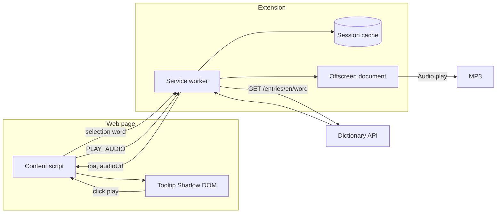

# 01 — Architecture

## Tổng quan



## Folder layout

```
VoiceChrExtention/
├── manifest.json              # Manifest V3 entry (root — Chrome convention)
├── src/
│   ├── background/
│   │   └── service-worker.js  # API lookup, cache, offscreen audio relay
│   ├── offscreen/
│   │   ├── offscreen.html     # Offscreen doc entry (audio playback)
│   │   └── offscreen.js
│   ├── content/
│   │   ├── content.js         # Selection listener, tooltip lifecycle
│   │   └── tooltip.css        # Styles injected into Shadow DOM
│   └── shared/
│       ├── messages.js        # Message type constants
│       ├── word.js            # Single-word validation, normalize
│       └── dictionary.js      # Parse API response → { ipa, audioUrl }
├── docs/                      # Design & research
└── projectmanagement/         # Task tracking
```

## Components

### Content script (`src/content/`)

- Inject vào mọi trang (`matches: ["<all_urls>"]`).
- Debounce selection (~300 ms).
- Validate từ đơn → gửi `LOOKUP_WORD` tới service worker.
- Render tooltip với IPA + nút 🔊; click gửi `PLAY_AUDIO` tới service worker (không play trực tiếp trên trang — tránh CSP).

### Offscreen document (`src/offscreen/`)

- Phát MP3 trong ngữ cảnh extension, không bị `media-src` CSP của trang web chặn.
- Service worker tạo offscreen doc khi cần (`AUDIO_PLAYBACK`).

### Service worker (`src/background/`)

- Xử lý `LOOKUP_WORD`: fetch Dictionary API, cache, trả `{ ipa, audioUrl }` hoặc lỗi.
- Không giữ DOM state.

### Shared (`src/shared/`)

- Logic thuần (parse, validate) dùng chung; tránh duplicate giữa content và background.

## Message contract

| Type | Direction | Payload | Response |
|------|-----------|---------|----------|
| `LOOKUP_WORD` | content → background | `{ word: string }` | `{ ok: true, ipa, audioUrl }` hoặc `{ ok: false, error }` |
| `PLAY_AUDIO` | content → background | `{ url: string }` | `{ ok: true }` hoặc `{ ok: false, error }` |

## Manifest V3 (dự kiến)

```json
{
  "manifest_version": 3,
  "name": "VoiceChrExtention",
  "version": "0.1.3",
  "permissions": ["offscreen"],
  "host_permissions": [
    "https://api.dictionaryapi.dev/*",
    "https://*/*"
  ],
  "background": {
    "service_worker": "src/background/service-worker.js",
    "type": "module"
  },
  "content_scripts": [{
    "matches": ["<all_urls>"],
    "js": ["src/content/content.js"],
    "run_at": "document_idle"
  }]
}
```

`host_permissions` cho `https://*/*` hỗ trợ audio URL từ CDN (vd. `ssl.gstatic.com`). Có thể thu hẹp sau khi biết pattern URL audio ổn định.

## Luồng chính

1. User select text → content script validate từ đơn.
2. Content gửi word → service worker.
3. Service worker cache hit → trả ngay; miss → fetch API → parse → cache → trả.
4. Content hiện tooltip IPA + nút play.
5. User click play → `new Audio(audioUrl).play()` (normalize URL `//` → `https:`).
